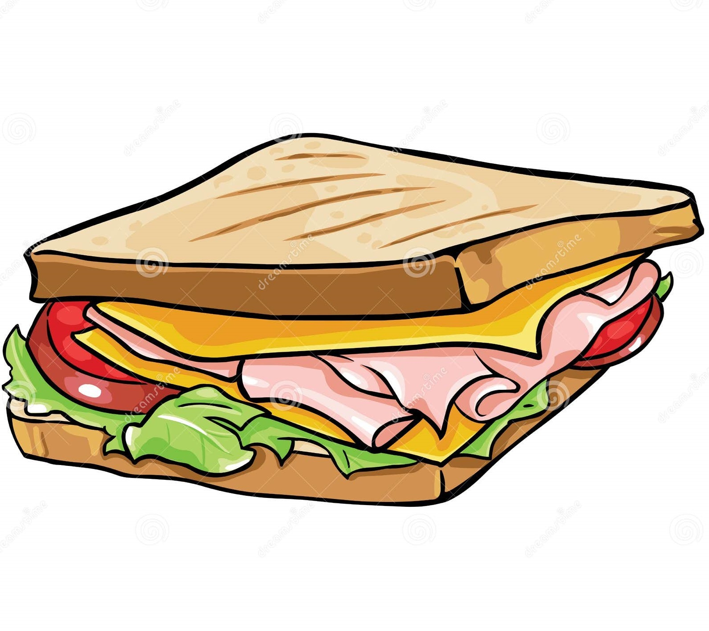

# hmsandwich 

<!-- badges: start -->
[](https://www.repostatus.org/#concept)
<!-- badges: end -->

The goal of hmsandwich is to provide wrapper functions for the `hmer` package for a minimal workflow.

## Installation

You can install the development version of hmsandwich from [GitHub](https://github.com/) with:

``` r
# install.packages("devtools")
devtools::install_github("n8thangreen/hmsandwich")
```

## Example

This is a basic example of what a workflow may look like:

``` r
library(hmsandwich)

# create analysis object
gono_hmer <- 
  hmer_analysis() |> 
  add_input_ranges(names, data) |> 
  add_targets(names, data) |> 
  add_model(gono_model)

# run initial wave
gono_hmer <- run_wave(gono_hmer)

# run first wave
gono_hmer <- run_wave(gono_hmer)
```

We may end up using `R6` so that the wave running steps would look like

```r
gono_hmer@run_wave
```

Once the wave is run then visualisation can be run separately.
